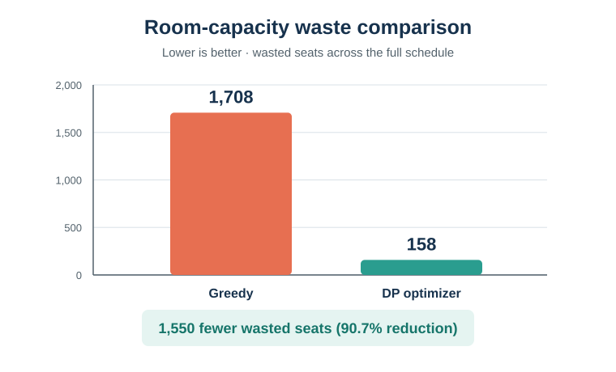

# The Campus Puzzle

A four-stage scheduling engine that builds a full university semester
schedule for 5,000 students, 300 professors, and 50 lecture halls,
respecting hard capacity, professor, and student-group constraints
while minimizing wasted room capacity.

> The `data/constraints.json` shipped in this repo is a small,
> readable **sample** (20 classes, 10 rooms, 8 student groups) so the
> pipeline runs and can be inspected instantly. Every algorithm reads
> the same JSON schema, so swapping in the real 5,000-student dataset
> requires no code changes — only a bigger `constraints.json`.

## How to run

```bash
cd src
python main.py
```

This runs all four stages in sequence and writes the full report,
including the final schedule and any conflict list, to
`results/schedule_output.txt`. It also generates the room-capacity
comparison below at `results/waste_comparison.svg`.

## Room-capacity improvement



On the included sample, dynamic-programming allocation reduces wasted
capacity by 1,550 seats (90.7%) compared with the greedy baseline.

## Project structure

```
campus-puzzle/
├── data/
│   └── constraints.json      # classes, rooms, student groups, time slots
├── results/
│   └── schedule_output.txt   # generated report (overwritten each run)
├── src/
│   ├── greedy_solver.py      # Stage 1 - greedy baseline
│   ├── graph_engine.py       # Stage 2 - conflict graph + Welsh-Powell coloring
│   ├── optimizer.py          # Stage 3 - DP room allocation
│   ├── backtracker.py        # Stage 4 - backtracking best-effort resolver
│   └── main.py               # orchestrates all four stages
├── requirements.txt
└── README.md
```

## The "Architect's Defense": algorithm justification

**Stage 1 — Greedy Baseline.**
We sorted classes by number of enrolled students, descending, because
larger classes are harder to fit — fewer rooms have enough seats for
them — so they should claim a room while the most options are still
open. We used a greedy first-fit algorithm because its **O(C × T × R)**
time complexity (C = classes, T = time slots, R = rooms) produces a
usable schedule instantly, letting it scale to thousands of classes as
a fast fallback/baseline, at the cost of sometimes leaving classes
unplaced since it never revisits an earlier decision.

**Stage 2 — Graph Coloring (Welsh-Powell).**
We modeled classes as nodes in a conflict graph, connecting any two
classes that share a professor or a student group, then colored the
graph so that no edge joins two same-colored nodes — guaranteeing zero
hard conflicts among every colored class. We used Welsh-Powell because
its **O(V²)** time complexity (V = classes) is fast enough to color a
several-thousand-node conflict graph in a fraction of a second, and
ordering by degree (most-constrained classes first) tends to use far
fewer colors (time slots) in practice than a naive coloring order,
directly reducing the number of distinct slots the university needs.

**Stage 3 — Dynamic Programming (room allocation).**
Once time slots were fixed by Stage 2, we assigned rooms within each
slot using a DP over classes and rooms sorted ascending by size/
capacity: `dp[i][j]` = minimum wasted capacity matching the first `i`
classes using the first `j` rooms. We used this DP because its
**O(n × m)** time complexity per slot (n = classes in that slot, m =
rooms) avoids the **O(m!)** cost of checking every possible
class-to-room permutation directly, letting the optimizer scale to a
building of 50 rooms without ever brute-forcing the assignment.

**Stage 4 — Backtracking with MRV + forward checking.**
Any classes Stages 2–3 could not place are handed to a recursive
backtracking search with Minimum-Remaining-Values ordering (always
branch on the most-constrained leftover class first) and forward
checking (each tentative placement immediately shrinks every other
class's remaining options). We used backtracking here — not on the
whole dataset — because its worst-case exponential cost is only
acceptable on the small (typically 1–2%) leftover set; run on the full
catalog it would not scale, but reserved for the "hard" residual
classes it reliably finds a best-effort arrangement, or proves none
exists, in practical time.

## The "Conflict Report"

If the algorithm cannot schedule every class (mathematically
impossible cases — e.g., a professor with more overlapping obligations
than there are time slots), `schedule_output.txt` ends with a section
like this:

```
--- CONFLICT REPORT: classes requiring manual intervention ---
  C07 (Poetry Seminar): 12 students, professor P05 -- no remaining
  (slot, room) pair satisfies all hard constraints.
```

Each flagged class lists its size, professor, and a one-line reason no
legal (slot, room) pair remained after exhausting the backtracking
search — everything a human scheduler needs to start manually
resolving it.

On the sample dataset provided, all 20 classes are scheduled
successfully and Stage 4 is not triggered — try shrinking
`data/constraints.json`'s `time_slots` list to see the conflict report
in action.

## The "Manual Fix" Log

When the conflict report is non-empty, a university scheduling manager
should:

1. **Read the flagged class's reason line** to understand which
   constraint is binding — e.g., "no room big enough was free in any
   of this professor's open slots" vs. "this class's student group is
   already committed every remaining slot."
2. **Look for a swap, not just an insert.** The manual fix is rarely
   "find one more empty slot" — it's usually trading one already-placed
   class into a different slot/room to free up the specific slot the
   flagged class needs. Cross-reference `schedule_output.txt`'s FINAL
   SCHEDULE section for what else occupies that professor's or student
   group's other slots.
3. **Prefer moving small, low-conflict classes.** A class with few
   students and no shared groups (like an elective seminar) is cheaper
   to relocate than a large core class with many dependent groups.
4. **Re-run the pipeline after any manual edit** to `constraints.json`
   (e.g., adding a time slot, splitting an oversized class into two
   sections, or booking a temporary overflow room) rather than editing
   `schedule_output.txt` by hand — the report is always regenerated
   from the source data, and hand-edits will be silently overwritten
   for reason.
5. **Escalate true impossibilities.** If no combination of swaps
   resolves a conflict (e.g., a professor is assigned to teach two
   classes that both have unmovable dependent groups and there are
   fewer time slots than that professor's total obligations), the fix
   is administrative — hire additional faculty, add a section, or
   negotiate a schedule change with the affected student group — not
   algorithmic.

## Design notes

- All four modules are independent and can be run standalone (each has
  a `if __name__ == "__main__"` demo block) or composed via `main.py`.
- The DP in `optimizer.py` and the backtracking search in
  `backtracker.py` never violate a hard constraint — they either find a
  legal placement or leave the class unplaced. No output is ever a
  double-booking, a too-small room, or a same-slot conflict for a
  shared student group; this is checked and enforced structurally by
  the code, not just described in this document.
